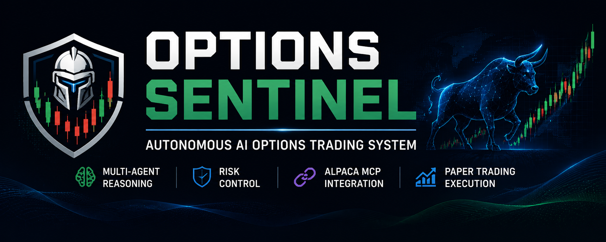

# Options Sentinel



## Autonomous AI Options Trading System with Alpaca MCP Integration

Options Sentinel is an autonomous AI options trading system that
combines multi-agent reasoning, deterministic risk controls, options
strategy generation, and Alpaca MCP-based execution.

The core principle:

> AI can analyse opportunities, but risk controls decide whether a trade
> is allowed.

## Overview

Options Sentinel creates an explainable AI trading workflow where
specialised agents analyse market conditions, challenge decisions, and
validate trades before execution.

The system performs:

-   Market analysis
-   Multi-agent reasoning
-   Risk evaluation
-   Options strategy selection
-   Controlled paper trading execution

## Architecture

``` text
Market Data
     |
     v
Market Agent
     |
     v
Bull Agent <-> Bear Agent
     |
     v
Risk Agent
     |
     v
Decision Agent
     |
     v
Risk Gate
     |
     v
Options Strategy Engine
     |
     v
MCP Execution Layer
     |
     v
Alpaca Paper Trading
```

## Core Features

-   Multi-agent market reasoning
-   Bull/Bear decision debate
-   Deterministic risk validation
-   Options spread strategy generation
-   Alpaca MCP execution workflow
-   Paper trading support
-   Trade decision logging

## Technology Stack

-   Python
-   FastAPI
-   Alpaca API
-   Alpaca MCP Server
-   HTML/CSS/JavaScript
-   Pytest

## Project Structure

``` text
agents/       AI decision agents
market/       Market data and analysis
options/      Options strategy engine
risk/         Risk management system
execution/    MCP and Alpaca execution
monitoring/   Position monitoring
backend/      FastAPI services
dashboard/    User interface
```

## Installation

``` bash
git clone https://github.com/YOUR_USERNAME/options-sentinel.git
cd options-sentinel

python -m venv venv
venv\Scripts\activate

pip install -r requirements.txt
```

## Configuration

Create a `.env` file:

``` env
ALPACA_API_KEY=
ALPACA_SECRET_KEY=
ALPACA_PAPER=true
```

## Running

``` bash
python run.py
```

## Testing

``` bash
pytest
```

## Demo Flow

``` text
Market Analysis
       |
       v
AI Agent Debate
       |
       v
Risk Approval
       |
       v
Options Strategy
       |
       v
MCP Execution
       |
       v
Paper Trade
       |
       v
Trade Journal
```

## Disclaimer

This project is for educational and research purposes only. It uses
Alpaca Paper Trading and does not provide financial advice.

## License

MIT License
